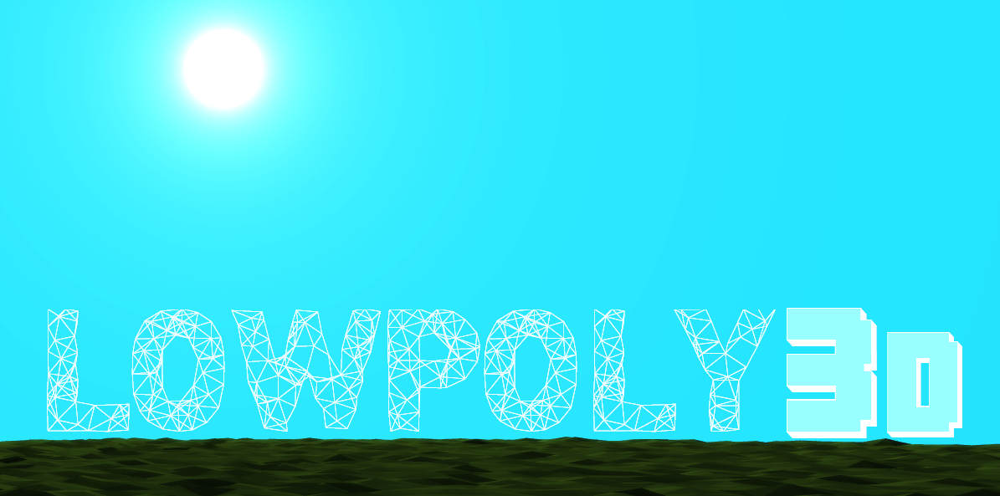

[](https://travis-ci.org/Kuxe/lowpoly3d)
[](https://ci.appveyor.com/project/Kuxe/lowpoly3d)


A 3D engine tailored towards procedurally generated low poly graphics, using OpenGL. Lowpoly3d builds under Windows, OSX and Linux.

Lowpoly3d is a hobby project :).

## Self-contained example
```c++
#include "lowpoly3d.hpp"

/** Example file illustrating how to use lowpoly3d **/
using namespace std::chrono;
using namespace lowpoly3d;
struct Game : public ILowpolyInput {
	bool running = true;
	float dt = 0.0f;
	Camera camera;
	std::unordered_set<int> heldKeys;
	std::vector<RenderData> rds = {
		{translate(glm::mat4(1.0f), -100.0f*glm::vec3(1.0f, 0.0, 1.0f)), "terrain", "default"},
		{scale(glm::mat4(1.0f), glm::vec3(-150.f)), "sphere", "skybox"},
		{glm::mat4(1.0f), "sphere", "default"}
	};

	void onKey(int key, int scancode, int action, int mods) {
		if(action == GLFW_PRESS) heldKeys.insert(key);
		else if(action == GLFW_RELEASE) heldKeys.erase(key);
	}

	void onMouse(double xpos, double ypos) {
		camera.look({xpos, ypos}, dt);
	}

	void run(Renderer& renderer) {
		using ms = duration<float, std::milli>;
		const auto start = high_resolution_clock::now();
		const auto gametime = [start] {
			return duration_cast<ms>(high_resolution_clock::now() - start).count() / 1000.0f;
		};
		while(running) {
			//Game logic here - handle input and make a sphere go round and round
			const float gt = gametime();
			for(const int key : heldKeys) {
				switch(key) {
					case GLFW_KEY_W: camera.dolly(+3.0f * dt); break;
					case GLFW_KEY_A: camera.truck(-3.0f * dt); break;
					case GLFW_KEY_S: camera.dolly(-3.0f * dt); break;
					case GLFW_KEY_D: camera.truck(+3.0f * dt); break;
					case GLFW_KEY_Q: camera.pedestal(-3.0f * dt); break;
					case GLFW_KEY_E: camera.pedestal(+3.0f * dt); break;
					case GLFW_KEY_ESCAPE: running = false; break;
				}
			}
			rds[2].modelMatrix[3] = 5.0f*glm::vec4(cosf(gt), 1.0f, sinf(gt), .2f);
			rds[1].modelMatrix[3] = glm::vec4(camera.eye, 1.0f);
			renderer.offer({rds, camera.view(), .1f*gt}); //Render a scene
			std::this_thread::sleep_for(1ms); //Workaround to prevent dt=0.0f
			dt = gametime() - gt;
		}
	}
};

int main(int argc, char** argv) {
	/** Create game and renderer objects and start running the game on new thread,
		using lowpoly3d as the game renderer. Notice that we haven't initialized
		renderer yet, so nothing will be rendered just yet **/
	Game game;
	Renderer lowpoly3d;
	std::thread thread([&] { game.run(lowpoly3d); });

	/** Create some 3d-model generators and initialize lowpoly3d with generated model **/
	SphereGenerator sg({125.0f, 125.0f, 125.0f}, 3);
	TerrainGenerator tg;
	lowpoly3d.initialize(&game, "../shaders/") &&
	lowpoly3d.loadModels("sphere", sg.generate(), "terrain", tg.generate()) &&
	lowpoly3d.run(); //Main-thread will remain in lowpoly3d.run() until lowpoly3d terminates
	game.running = false; //terminate game and join game thread with main thread
	thread.join();
	lowpoly3d.terminate();
	return 0;
}
```

## Building (Linux and OSX)
Run `cmake .. && make` from within the build directory.

## Building (Windows)
Run `cmake -G "MinGW Makefiles" ..; make` from within the build directory.

## Installing (Windows and Linux)
After building, run `make install` from within the build directory.

## Installing (OSX)
Have not tried installing on OSX.

# How do I use lowpoly3d?

## The LowpolyInput interface
The LowpolyInput interface specifies what the renderer might send back to you (keypresses for example). The window created by lowpoly3d captures input from keyboard and mouse if the window is active. Therefore there must be some channel where data can move from the renderer to your game. The LowpolyInput interface serves as this channel. LowpolyInput is an interface which demands of you to implement some methods such as "onMouse" and "onKeyPress". These methods are called by lowpoly3d renderer whenver it receives whatever event you provoked.

## Three important structs
In addition there are three important structs which you should embrace to get going with lowpoly3d.

### Scene
A lowpoly3d scene is a struct which contains all data which is required by the class `Renderer` when rendering a frame, such as a view-matrix or where the sun is located. In order to trigger lowpoly3d into rendering anything you must call `setScene(const Scene& scene)`.

### RenderData
If your game has a hero, the `Renderer` cares only about the whereabouts of your hero (the `modelMatrix` member of RenderData) and what he looks like (the `model` member of RenderData).. and what shader he should be rendered with (the `shader` member of RenderData). These are the three members of RenderData. The `Scene`-class has a member `std::vector<RenderData> renderDatas` which you should populate before rendering the scene. So anything you want to show in your scene should be represented by an instance of `Renderdata` within the `renderDatas` vector.

### Model
Model represents a 3d model. It consists of a vector of N vertices, another vector of N vertex colors and a vector of M triangles, where a triangle in this context is three indices used for indexed drawing. A model is generated by a ModelGenerator.

## Model generators
A `ModelGenerator` is an interface that when realized spits out a `Model`. It is a very simple interface (`struct ModelGenerator { virtual Model generate() = 0; };`). Examples are `SphereGenerator` or `TerrainGenerator`.
